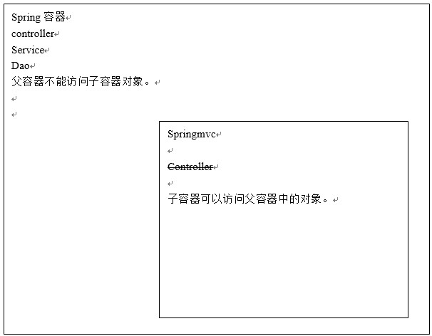

# 框架整合

## SSM 框架整合

### 整合的思路

- DAO 层

> 使用mybatis框架。创建SqlMapConfig.xml。
>
> 创建一个applicationContext-dao.xml
>
> - 1、配置数据源
>
> - 2、需要让spring容器管理SqlsessionFactory，单例存在。
>
> - 3、把mapper的代理对象放到spring容器中。使用扫描包的方式加载mapper的代理对象。

- Server 层

> - 1、事务管理
>
> - 2、需要把service实现类对象放到spring容器中管理。

- 表现层

> - 1、配置注解驱动
>
> - 2、配置视图解析器
>
> - 3、需要扫描controller

- 配置WEB.xml

> - 1、spring容器的配置
> - 2、Springmvc前端控制器的配置
> - 3、Post乱码过滤器

### 框架整合

需要把配置文件放到mall-manager-web工程下。因为此工程为war工程，其他的工程只是一个jar包。

/：会拦截所有请求包括静态资源。需要在springmvc.xml中添加静态资源的映射。

### Springmvc和spring的父子容器关系

    在applicationContext-service中配置：
    <!-- 扫描包加载Service实现类 -->
    <context:component-scan base-package="com.taotao"></context:component-scan>
    会扫描@Controller、@Service、@Repository、@Compnent

    Springmvc。Xml中不扫描。
    结论：springmvc。不能提供服务，因为springmvc子容器中没有controller对象。

