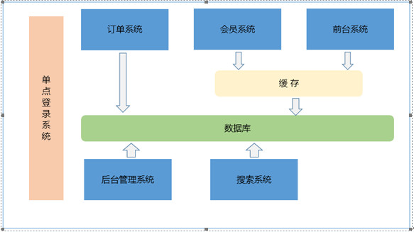

# 电子商城

## 电商行业技术特点

> 技术新
> 技术范围广
> 分布式
> 高并发、集群、负载均衡、高可用
> 海量数据
> 业务复杂
> 系统安全

## 电商行业的模式：

> B2B: 企业到企业，商家到商家。代表：阿里巴巴、慧聪网。
>
> B2C: 商家到客户。代表：京东、淘宝商城（B2B2C）。
>
> C2C: 商家到客户。代表：京东、淘宝商城（B2B2C）。
>
> O2O: 线上到线下。

## 功能模块

## 传统系统架构

> 思考：问题慢慢突显!
>
> 1、	模块之间耦合度太高，其中一个升级其他都得升级
>
> 2、	开发困难，各个团队开发最后都要整合一起
>
> 3、	系统的扩展性差
>
> 4、	不能灵活的进行分布式部署。

> 解决方案：
>
> 优点：
>
> - 把模块拆分成独立的工程，单点运行。如果某一个点压力大可以对这一个点单独增加配置。其他的点不受影响。
>
> 缺点：
>
> - 系统之间交互需要额外的工作量来进行接口的开发。

【总结：】

- 1、加服务器、加Tomcat,但跑的还是同一套代码，这叫做集群。

- 2、把系统拆分成多个工程，要完成系统的工程需要多个工程协作完成。这种形式叫做分布式。

## 分布式架构

> 分布式架构：
>
> 把系统按照模块拆分成多个子系统。
>
> 优点：
>
> - 1、把模块拆分，使用接口通信，降低模块之间的耦合度。
>
> - 2、把项目拆分成若干个子项目，不同的团队负责不同的子项目。
>
> - 3、增加功能时只需要再增加一个子项目，调用其他系统的接口就可以。
>
> - 4、可以灵活的进行分布式部署。
>
> 缺点：
>
> 系统之间交互需要使用远程通信，接口开发增加工作量。

## 技术选型 （主要技术）

- Spring、SpringMVC、Mybatis
- JSP、JSTL、jQuery、jQuery plugin、EasyUI、KindEditor（富文本编辑器）、CSS+DIV
- Redis（缓存服务器）
- Solr（搜索）
- httpclient（调用系统服务）
- Mysql
- Nginx（web服务器）

## Maven 管理

1、依赖管理、jar包、工程之间的依赖。

2、项目构建。实现项目的一步构建。

3、工程聚合、继承、依赖。

Maven工程类型：

- war 包工程

- jar 包工程

- Pom 工程

父工程的搭建：

    父工程应该是一个pom工程。在父工程中定义依赖的jar包的版本信息。Maven插件的版本。
    
    

